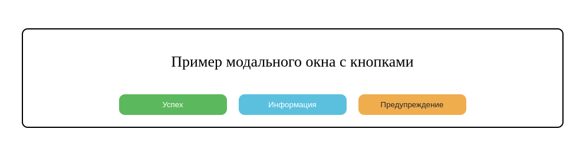

# Модальное окно

Каскадные таблицы стилей описывают правила форматирования элементов с помощью свойств и допустимых значений этих свойств. Можно устанавливать как общие свойства, так и отдельные свойства для каждого элемента.

В веб-приложениях очень часто используют модальные окна, позволяющие донести до пользователя важную информацию и/или узнать результат его выбора.
Твоя задача - сверстать вариант такого модального окна. HTML-код уже готов, тебе осталось только добавить нужные классы, идентификаторы и стили, чтобы получить максимально похожий на образец результат.

**Обрати внимание - готовое модальное окно должно располагаться по центру экрана.**

Образец:


Код:
```html
<div class="main">
  <div>
    <div>Пример модального окна с кнопками</div>
    <div>
      <button type="button">Успех</button>
      <button type="button">Информация</button>
      <button type="button">Предупреждение</button>
    </div>
  </div>
</div>
```

### Release 0. Подготовка
- Создай новый HTML-файл, добавь необходимую разметку
- Скопируй код и вставь его в свой файл
- Внимательно посмотри, какие элементы присутствуют на странице, как они выглядят, где находятся и как все должно выглядеть в итоге
- Подумай, какие свойства у элементов общие, а какие индивидуальные?

### Release 1. Классы, идентификаторы...
- Добавь необходимые классы и идентификаторы блокам и элементам.

### Release 2. Стилизация
- Создай файл со стилями и подключи его к своей странице
- Пропиши необходимые стили так, чтобы итоговый вариант был максимально похож на образец. Не забудь об общих и индивидуальных стилях.

Когда всё сделаешь конечно же делай `Pull Request`!
