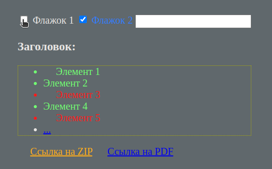

# Стилизация вложенных элементов

Понимание принципа каскадности стилей и навыки стилизации вложенных элементов - очень важные составляющие работы веб-разработчика.
Давай потренируемся!

Исходный код:
```html
<div class="container">
  <input type="checkbox" id="check1" />
  <label for="check1">Флажок 1</label>
  <input type="checkbox" checked id="check2" />
  <label for="check2">Флажок 2</label>
  <input type="text" id="input-text" />
  <h3 class="header">Заголовок:</h3>
  <ul class="list">
    <li class="list-item" id="item-1">Элемент 1</li>
    <li class="list-item" id="item-2">Элемент 2</li>
    <li class="list-item" id="item-3" data-action="delete">Элемент 3</li>
    <li class="list-item" id="item-4" data-action="edit do-not-delete">
      Элемент 4
    </li>
    <li class="list-item" id="item-5" data-action="edit delete">
      Элемент 5
    </li>
    <li><a href="#">...</a></li>
  </ul>
  <a href="http://site.com/file.zip">Ссылка на ZIP</a>
  <a href="http://site.com/file.pdf">Ссылка на PDF</a>
</div>
```

**Исходный код менять нельзя!**

Задачи:
- Добавить стиль, меняющий вид указателя мыши на pointer при наведении на любой checkbox
- Если checkbox отмечен, текст его метки должен становиться синим
- Найди все элементы с id=item-* и поменяй их цвет на зеленый
- Найди все ссылки на файлы с расширением "zip" и сделай их цвет оранжевым
- Найди все элементы с атрибутом data-action, содержащим delete в списке (отдельным словом) и сделай их цвет красным
- Выбери все нечетные элементы списка .list и сделай у них расстояние между маркером списка и текстом = 20 пикселей
- Выбери один элемент сразу за заголовком h3 с классом "header" на том же уровне вложенности и сделай ему желтую рамку из точек шириной в 1 пиксель
- Выбери все ссылки, следующие за заголовком h3 с классом "header" на том же уровне вложенности и назначь им отступ слева = 20 пикселям


Твой итоговый результат должен быть максимально похож на образец:

<h1 align="center"></h1>


### Release 0. Подготовка
- Создай новый HTML-файл и скопируй в тег `body` исходный код
- Создай файл стилей, подключи его к HTML-файлу и добавь следующий код:

```css
body {
  background: grey;
  padding: 0 24px;
  color: white;
  margin: 0;
  height: 100vh;
  display: flex;
  justify-content: center;
  align-items: center;
}
```

### Release 1. Стилизация
- Выполняй задачи по-очереди, добавляя необходимые селекторы и стили в файл стилей
- На каждую задачу нужно написать только один селектор и добавить в него необходимые стили

Готово? Пройдись по селекторам еще раз, пойми их логику и делай `Pull request`
