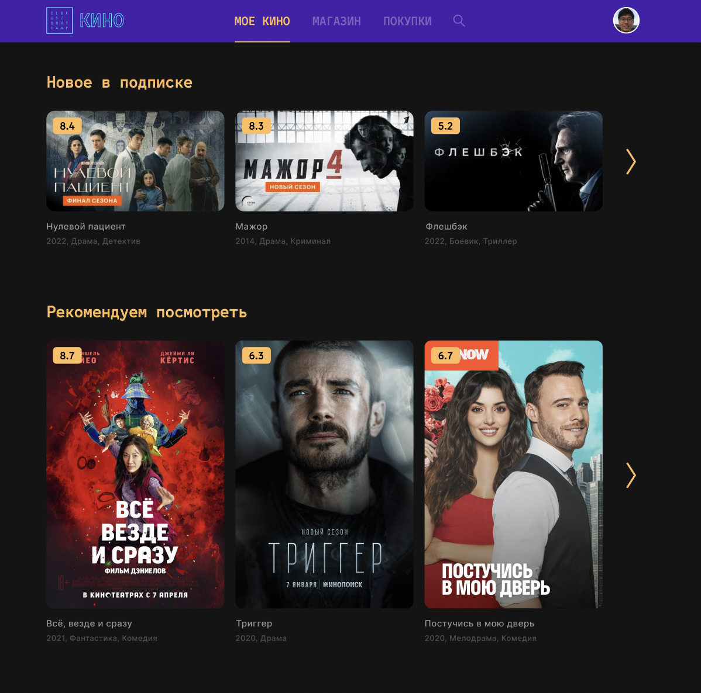

# CSS-Flexbox

### Введение

Все мы любим смотреть фильмы. Кто-то предпочитает ходить в кино, а кто-то оформляет подписку на какой-нибудь онлайн ресурс и смотрит всё дома. Мог бы ты представить неделю назад, что уже сможешь сверстать главную страницу подобного сайта? А ты сможешь!

### Релиз 0. Спланируй.
В терминале выполните команду: `npm install`   
Выполните работу в файле: `index.html` и `index.css`   

Тебе нужно сделать страничку по [макету](https://www.figma.com/file/Ck1iGc8eouskvGGfC9mueI/ECB-Phase-0-tasks-Desktop-share?node-id=0%3A1) (необходима авторизация в `Figma`).   

_Рисунок 1. Ориентировочный результат задания._

_Картинки к ElbrusKino ты найдешь в папке `img`_. Можно добавить свои картинки   

Для начала продумай план действий. Не забывай, что тебе тут будут необходимы `flexbox`. По каким блокам ты распределишь элементы? Где, какие свойства будешь использовать?

### Релиз 1. HTML.

Не торопись переходить к стилям. Сначала продумай структуру `html`. Постарайся сделать сразу всё правильно, расставить нужные классы и id, чтобы практически не трогать `html` после этого релиза.

### Релиз 2. CSS.

И, наконец, самое интересное. Стилизуй свой сайт. Старайся придерживаться примера на Рисунке 1. Тебе пригодятся следующие свойства: `display`, `justify-content`, `align-items`, `flex-wrap`, `margin`, `padding`, `flex-wrap`, `flex-shrink`, `flex-basis` и другие.
