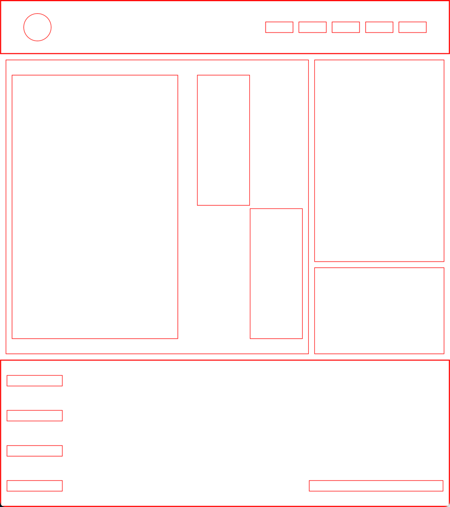

# Flexbox верстка
Сегодня тебе нужно сделать разметку страницы. `header` страницы уже сделан. Тебе нужно сделать центральный блок и `footer`. В этом задании нельзя использовать `position` и `float`. Чтобы отодвинуть блоки друг от друга, можно использовать `margin`, `padding` и `gap`. Ширину и высоту блоков можешь задать свою, главное, чтобы скелет был похож на макет ниже.

## Release 0. Подготовка
* Изучи `html` и `css` файлы.
* Подключи `styles.css` к `index.html`.

## Release 1. Реализация
* Создай левую часть центрально блока без внутренних блоков.
* Создай правую часть центрально блока.
* Создай `footer`.
* Задай необходимую ширину и высоту для каждого блока и добавь свойство `border`, чтобы видеть, где находятся блоки на странице.

## Release 2. Деплой
* Сделай `Pull request`.
