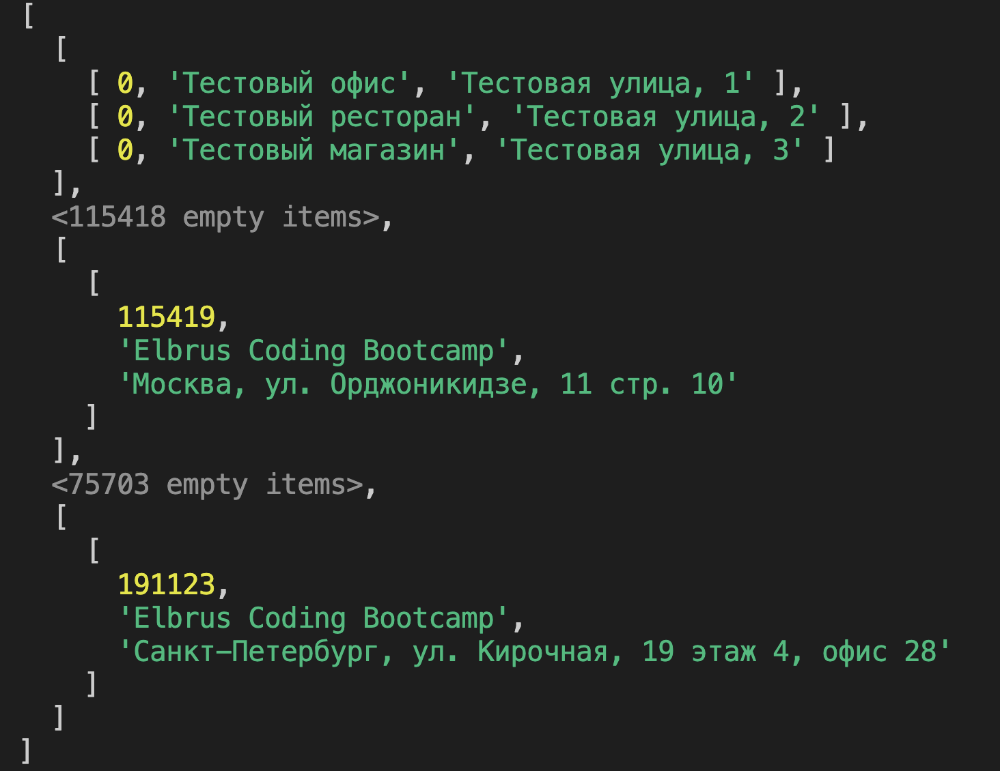

# Курьерский сервис

Привет!!! Я запускаю курьерский сервис, и мне нужно реализовать хранение адресов доставки (локаций).

Планируется максимально широкий охват, и я хочу использовать почтовые индексы.

## Release 1. Добавить тестовые локации

Каждая локация — это массив-[кортеж](https://ru.wikipedia.org/wiki/Кортеж_(информатика)) из 3 элементов:

1. `code` — почтовый индекс (число)
2. `title` — название адреса (строка)
3. `address` — сам адрес (строка)

Например:

```js
const elbrusMsk = [
  115419,
  'Elbrus Coding Bootcamp',
  'Москва, ул. Орджоникидзе, 11, стр. 10',
];

const elbrusSpb = [
  191123,
  'Elbrus Coding Bootcamp',
  'Санкт-Петербург, ул. Кирочная, 19, офис 28',
];
```

Создай несколько переменных с локациями для себя — 2-3 локации будет достаточно. Соблюдай заданный формат и порядок элементов.

Подумай, какой способ создания переменной подходит лучше всего. Значения этих переменных планируем присвоить всего один раз и больше их не переопределять.

Дай смысловые названия этим переменным — например, `home`, `work`, `gym` и так далее.

Готово? А теперь сделай ещё несколько тестовых локаций **с одинаковым почтовым индексом**. Можешь назвать их переменные как `testLocation1`, `testLocation2` и так далее.

Сделай как минимум один коммит для этого шага. Подумай над названием коммита. Затрудняешься? Переведи на английский язык название этого релиза.

## Release 2. Настроить хранение локаций

Создай массив `locations` для хранения локаций. Подумай, какой способ создания переменной подходит лучше всего — переопределять этот массив не планируем.

Массив `locations` будет хранить в себе вложенные массивы. Каждый почтовый индекс используется как обычный индекс массива `locations` и хранит в себе вложенный массив с локациями по этому почтовому индексу.

Пример структуры хранилища с тестовыми данными в консоли Node.js:


Массив с массивами называется двумерным массивом или матрицей (2D). Массив с массивами из массивов называется трёхмерным массивом или матрицей (3D). Подумай, какая у тебя получилась структура — 2D или 3D?

Сделай как минимум один коммит для этого шага. Удали все тестовые консольные логи перед коммитом.

Подумай над названием коммита. Затрудняешься? Переведи на английский язык название этого релиза.

## Release 3. Добавлять локации через функцию `add`

Создай функцию `add`, которая принимает в себя адрес (`location`) в формате, описанном выше.

Эта функция должна добавить заданную локацию в массив локаций по соответствующему почтовому индексу. Используй метод массива [`push`](https://developer.mozilla.org/ru/docs/Web/JavaScript/Reference/Global_Objects/Array/push) для этого.

Если по соответствующему почтовому индексу массива не существует, функция должна создавать его, прежде чем добавлять заданную локацию в общее хранилище. Для проверки, массив ли это, можно использовать метод [`Array.isArray()`](https://developer.mozilla.org/ru/docs/Web/JavaScript/Reference/Global_Objects/Array/isArray).

Добавь свои тестовые локации в эту структуру с помощью этой функции.

Сделай как минимум один коммит для этого шага. Удали все тестовые консольные логи перед коммитом.

Подумай над названием коммита. Затрудняешься? Переведи на английский язык название этого релиза.

## Всё готово?

Отправляй `Pull Request`!
