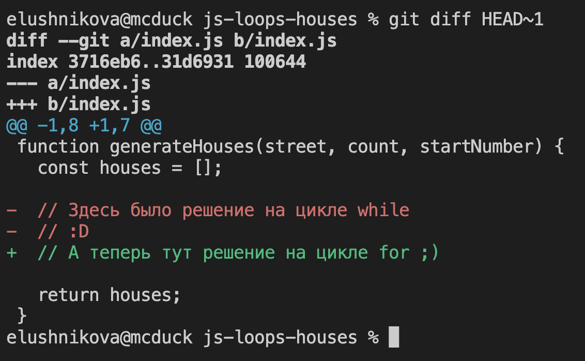
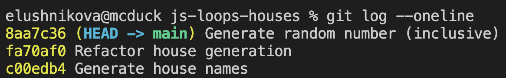
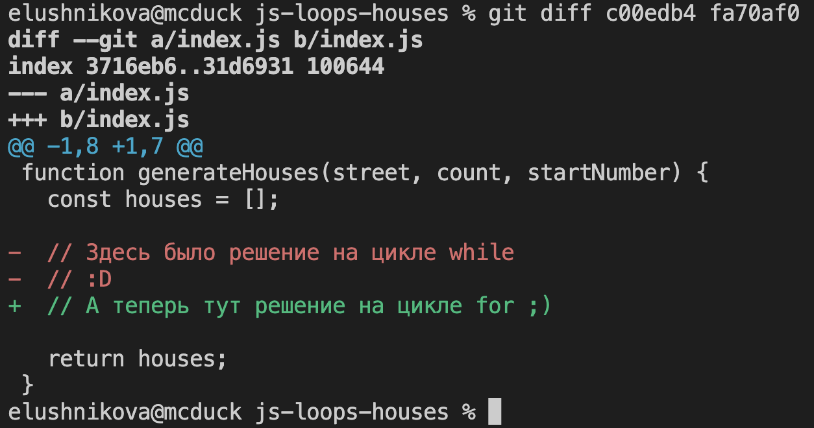

# Названия домов

Напиши helper (вспомогательную функцию) для генерации названий домов для игровой карты.

## Release 1. Генерировать названия домов

Создай функцию `generateHouses`, которая принимает следующие параметры:
- `street` — текстовое название улицы
- `count` — количество домов, которые нужно сгенерировать
- `startNumber` — стартовый номер дома

Функция должна возвращать массив с названиями домов по одной из сторон улицы — чётной или нечётной. Например:

```js
// сгенерировать четыре дома по нечётной стороне улицы, чьи номера начинаются с 99
const oddHouses = generateHouses('ул. Тестовая', 4, 99);
console.log(oddHouses);
// [
//   'ул. Тестовая, 99',
//   'ул. Тестовая, 101',
//   'ул. Тестовая, 103',
//   'ул. Тестовая, 105'
// ]
```

```js
// сгенерировать три дома по чётной стороне улицы, чьи номера начинаются с 42
const evenHouses = generateHouses('Тестовый проспект', 3, 42);
console.log(evenHouses);
// [
//   'Тестовый проспект, 42',
//   'Тестовый проспект, 44',
//   'Тестовый проспект, 46'
// ]

```

Проверь результаты и подготовь как минимум один коммит для этого релиза. Удали весь тестовый код (вызовы и консольные логи) перед коммитом.

Подумай над названием коммита. Если затрудняешься, переведи на английский язык название этого релиза.

## Release 2. Рефакторить генерацию домов
Рефакторинг — это изменение структуры кода без изменения его поведения (результатов). Обычно код рефакторят для того, чтобы сделать его более простым для понимания.

Однако сейчас нужно просто изменить код функции `generateHouses` — чтобы попрактиковаться с другим циклом. Работоспособность функции должна остаться такой же.

Если твой код работал на цикле `for` — перепиши его на `while`. Работал на `while`? Перепиши на `for`.

Проверь результаты и подготовь как минимум один коммит для этого релиза. Удали весь тестовый код (вызовы и консольные логи) перед коммитом.

Подумай над названием коммита. Если затрудняешься, переведи на английский язык название этого релиза.

## Предыдущая версия мне нравилась! Я хочу её оставить
Не бойся удалять закомментированный код — старому коду не место в проекте. На самом деле этот код **уже сохранён**, если ты делаешь коммит для каждого релиза.

---

### `git diff`
Эта команда позволяет видеть различия между двумя коммитами — и таким образом увидеть старую версию кода.

```bash
# увидеть разницу между 
# предпоследним коммитом (HEAD~1)
# и последним коммитом (HEAD)
git diff HEAD~1
```

<!-- markdownlint-disable no-inline-html -->
<details>
  <summary>Пример разницы в файле <code>index.js</code></summary>
  
</details>
<!-- markdownlint-enable no-inline-html -->

---

### `git log`
Если нужно сравнить код коммитов, поверх которых уже были созданы другие коммиты, понадобится узнать хэши — уникальные идентификаторы каждого коммита.

Для этого пригодится команда `git log`, которая позволит увидеть историю коммитов.

```bash
# увидеть историю коммитов в сжатом виде
# (один коммит — одна строчка в консоли)
git log --oneline
```

Пример истории коммитов:


Буквы и цифры в начале строчки обозначают фрагмент хэша коммита. Их можно использовать для сравнения коммитов через `git diff`:

```bash
# сравнить два коммита по их хэшам
git diff c00edb4 fa70af0
```

<!-- markdownlint-disable no-inline-html -->
<details>
  <summary>В моём случае результат будет идентичным полученному ранее.</summary>
  
</details>
<!-- markdownlint-enable no-inline-html -->

---
Если освоишь работу с диффами (отличиями) через командную строку — станешь гораздо лучше ориентироваться в гит истории различных проектов. Это очень полезный навык для разработчика.

Практикуйся с командами `git log` и `git diff` время от времени. И удаляй старый закомментированный код — его место в гит истории, а не в проекте.

---

## Всё готово?

Отправляй `Pull Request`!
