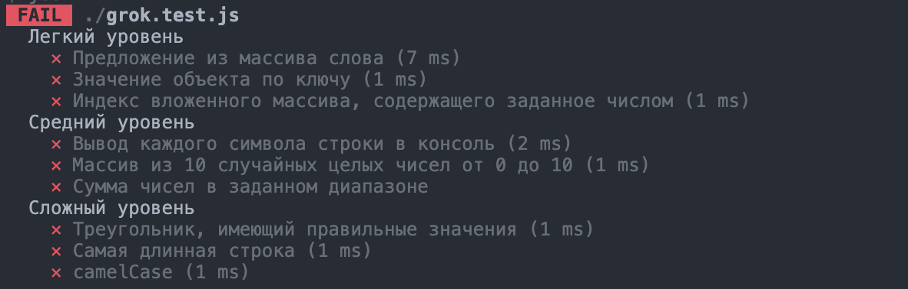
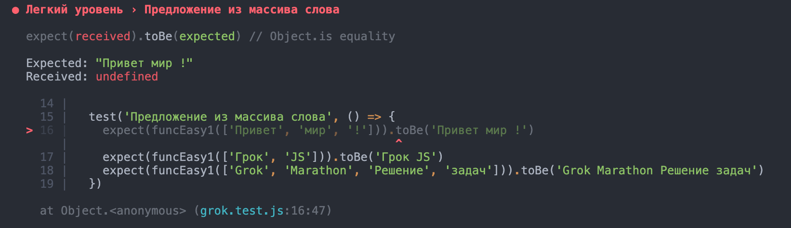

# Грок-спринт по основам JS 🐣

## Как с этим работать
В директории проекта находится 3 папки c упражнениями, разбитыми по сложности. В каждой папке три файла. Один файл — одно упражнение.  
  
### Используй тесты, чтобы проверить себя
1. После клонирования репозитория открой консоль и выполни команду `npm i`.
2. После выполнения каждого упражнения запускай тестирование командой `npm test`.

### Пролистай консоль вверх, чтобы посмотреть успешно пройденные тесты
  
  

### Узнай больше информации о непройденном тесте

```bash
Expected: что ожидал тест  
Received: что у тебя получилось  
```

  

## Release 0
Выполни легкие упражнения из папки **Easy**  

## Release 1
Выполни упражнения средней сложности из папки **Medium**  

## Release 2
Выполни сложные упражнения из папки **Hard**. В этих заданиях тебе нужно прописать аргументы функций самостоятельно.
