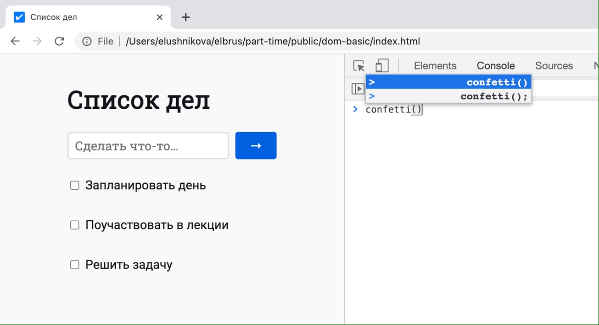

# Список дел

Наконец-то пришли дизайн и вёрстка для [приложения со списком дел](https://github.com/part-time-javascript-elbrus-bootcamp/js-objects-basic)! Займись этой задачей, даже если вчерашняя задача не доделана.

Изучи веб-страницу и сделай её интерактивной — для этого нужно поработать с браузерными событиями и DOM-деревом.

## Изучить документ
Давай рассмотрим HTML-документ и как браузер его представляет.

Открой в текстовом редакторе файл [index.html](index.html) — он хранится в этом репозитории. Структура этого документа довольно проста:
- `<html>` — корневой элемент
  - `<head>` — прямой потомок `<html>`
  - `<body>` — прямой потомок `<html>`
    - `<main>` — чей это потомок?
      - …

Прочти файл полностью. Какие ещё элементы существуют? Как они организованы? Как поймёшь структуру документа, запусти файл `index.html` в браузере.

Браузер анализирует текст документа и преобразует каждый HTML-элемент в объект — DOM-узел. Из этих объектов браузер строит DOM-дерево — древовидную структуру узлов.

Ты можешь исследовать DOM-дерево в своём браузере с помощью инструментов разработчика (DevTools):
- браузер Chrome → вкладка "Elements",
- браузер Firefox → вкладка "Inspector".

В этой вкладке DOM отображается как вложенный список. Ты можешь разворачивать и сворачивать отдельные ветви DOM-дерева. Каждый узел подсвечивается на странице, если навести на него курсор.


## Извлечь информацию из DOM

Поработай с DOM-объектами в консоли разработчика — в браузерах эта вкладка называется "Console". В ней ты можешь писать и выполнять JavaScript-код.

Браузер предоставляет доступ к DOM через объект `document`. Это корень дерева DOM, и можно использовать его для извлечения информации. Попрактикуйся в поиске информации через `document` и его вложенные объекты. Постарайся ответить на вопросы самостоятельно, но пользуйся подсказками, если застрянешь.

<!-- markdownlint-disable no-inline-html -->
<details>
<summary>
1. Как получить заголовок страницы — содержимое тега <code>&lt;title&gt;</code>?
</summary>
<pre>
document.title;
</pre>
</details>

<details>
<summary>
2. Как найти форму создания задачи — с именем <code>create-task</code>?
</summary>
<pre>
document.forms['create-task'];
</pre>
Или:
<pre>
document.querySelector('form[name=create-task]');
</pre>
</details>

<details>
<summary>
3. Как найти в форме создания <code>&lt;input&gt;</code> с именем <code>text</code>?
</summary>
<pre>
const form = document.forms['create-task'];
form.elements['text'];
</pre>
Или:
<pre>
form.querySelector('input[name=text]');
</pre>
</details>

<details>
<summary>
4. Как получить значение из <code>&lt;input&gt;</code> с именем <code>text</code>?
</summary>
<pre>
const form = document.forms['create-task'];
const input = form.elements['text'];
input.value;
</pre>
</details>

<details>
<summary>
5. Как найти список задач — элемент с классом <code>js-list</code>?
</summary>
<pre>
document.querySelector('.js-list');
</pre>
Или:
<pre>
document.getElementsByClassName('js-list')[0];
</pre>
</details>

<details>
<summary>
6. Как найти все элементы <code>&lt;li&gt;</code> внутри списка задач?
</summary>
<pre>
const list = document.querySelector('.js-list');
list.querySelectorAll('li');
</pre>
Или:
<pre>
list.getElementsByTagName('li');
</pre>
Или:
<pre>
// Получить всех прямых потомков списка задач
list.children;
</pre>
</details>

<details>
<summary>
7. Как найти элементы, <code>id</code> которых начинается с <code>"task-"</code>?
</summary>
<pre>
document.querySelectorAll('[id^=task-]');
</pre>
</details>

<details>
<summary>
8. Как найти <code>&lt;li&gt;</code>, ближайший к элементу с <code>id="task-0"</code>?
</summary>
<pre>
const task0 = document.getElementById('task-0');
task0.closest('li');
</pre>
</details>

<details>
<summary>
9. Как получить содержимое атрибута <code>data-id</code> на первом <code>&lt;li&gt;</code>?
</summary>
<pre>
const li = document.querySelector('li');
li.dataset.id;
</pre>
<a href="https://developer.mozilla.org/ru/docs/Learn/HTML/Howto/Use_data_attributes">MDN: Использование data-* атрибутов</a>
</details>

<details>
<summary>
10. Как получить текстовое содержимое элемента <code>&lt;h1&gt;</code>?
</summary>
<pre>
const heading = document.querySelector('h1');
heading.innerText;
</pre>
</details>

<details>
<summary>
11. Как найти элементы с классом <code>js-toggle</code>?
</summary>
<pre>
document.querySelectorAll('.js-toggle');
</pre>
Или:
<pre>
document.getElementsByClassName('js-toggle');
</pre>
</details>

<details>
<summary>
12. Как узнать, включён ли первый флажок с классом <code>js-toggle</code>?
</summary>
<pre>
const checkbox = document.querySelector('.js-toggle');
checkbox.checked;
</pre>
</details>
<!-- markdownlint-enable no-inline-html -->

## Release 1. Запускать конфетти, когда задача сделана
На страницу подключён сторонний скрипт — `confetti.browser.min.js`. Ты можешь проверить его работу, запустив этот код в консоли браузера:

```js
confetti();
```



Нужно запустить конфетти при выполнении задачи — то есть, когда флажок с классом `js-toggle` был изменён на включённое состояние (`checked`).

Пиши свой код в файле `scripts/index.js`. Тебе понадобится:
1. найти нужный элемент (элементы?) в DOM-дереве
2. через метод `addEventListener` добавить [обработчик события](https://learn.javascript.ru/introduction-browser-events#obrabotchiki-sobytiy)
    - событие изменения называется "`change`"
3. получить доступ к флажку через `event.target` или `event.currentTarget`
    - в чём разница между ними?
4. получить доступ к значению флажка — включён или нет
5. если флажок включён, запустить конфетти:

   ```js
   confetti({ disableForReducedMotion: true });
   ```

    <!-- markdownlint-disable no-inline-html -->
    <details>
    <summary>
    Что такое reduced motion?
    </summary>
    <p>
    Конфетти запустится лишь для тех пользователей, которые не запрашивали свою операционную систему <b>уменьшить количество движений</b> в интерфейсе.
    </p>
    <p>
    Когда работаешь с анимацией, старайся уважать выбор пользователей. В CSS это можно сделать через медиа-функцию. Узнать больше можно здесь:
    </p>
    <p>
    <a href="https://developer.mozilla.org/ru/docs/Web/CSS/@media/prefers-reduced-motion">MDN: prefers-reduced-motion</a>
    </p>
    </details>
    <!-- markdownlint-enable no-inline-html -->

Проверь результаты и подготовь как минимум один коммит для этого релиза. Удали весь тестовый код (вызовы и консольные логи) перед коммитом.

Подумай над названием коммита. Если затрудняешься, переведи на английский язык название этого релиза.

## Release 2. Создавать задачу через форму (необязательно)
Поработай с формой создания задачи:
1. перехвати событие отправки (`submit`) формы и обработай его

2. отмени действие браузера по умолчанию
    - [MDN: Метод `preventDefault`](https://developer.mozilla.org/ru/docs/Web/API/Event/preventDefault)

3. получи значение из текстового поля

4. создай DOM-узлы, необходимые для отрисовки задачи — ориентируйся на уже существующие элементы
    - [MDN: Метод `createElement`](https://developer.mozilla.org/ru/docs/Web/API/Document/createElement)

5. задай необходимые атрибуты для DOM-узлов
    - [MDN: Метод `setAttribute`](https://developer.mozilla.org/ru/docs/Web/API/Element/setAttribute)
6. Вложи тексты в DOM-узлы, а затем и сами DOM-узлы друг в друга
    - [MDN: Метод `append`](https://developer.mozilla.org/ru/docs/Web/API/Element/append)

Проверь, что новая задача отображается на странице после отправки формы. При перезагрузке страницы все созданные задачи будут сбрасываться — пока это нормально.

Подготовь как минимум один коммит для этого релиза. Удали весь тестовый код (вызовы и консольные логи) перед коммитом.

Подумай над названием коммита. Если затрудняешься, переведи на английский язык название этого релиза.

## Release 3. Починить запуск конфетти (необязательно)
Проверь, работает ли запуск конфетти при выполнении задач, созданных через форму? Если нет, то попробуй разобраться и починить.

Тебе пригодится [делегирование событий](https://learn.javascript.ru/event-delegation) — важный приём разработки веб-приложений.

Подготовь как минимум один коммит для этого релиза. Удали весь тестовый код (вызовы и консольные логи) перед коммитом.

Подумай над названием коммита. Если затрудняешься, переведи на английский язык название этого релиза.

## Всё готово?

Отправляй `Pull Request`!
